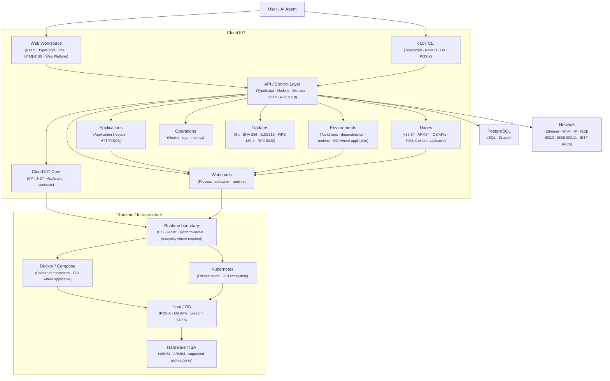

# Architecture

Cloud107 is organized around a web workspace, an API layer, persistent state, and connected workloads and resources.

This page describes the current architecture and the boundaries between its implemented components.

## Guide

### 1. Architecture blueprint



<details>
<summary><strong>Architecture reference map</strong></summary>

| Module | Stack / reference |
|---|---|
| Web workspace | React · TypeScript · Vite · HTML/CSS · Web Platform |
| API | Node.js · Express · HTTP/JSON · RFC 9110 |
| CLI | TypeScript · Node.js · Git · POSIX |
| Core | C# · .NET · application contracts |
| Applications | Application lifecycle · HTTP/JSON |
| Environments | Toolchains · dependencies · runtime · OCI where applicable |
| Nodes | x86-64 · ARM64 · OS APIs · POSIX where applicable |
| Workloads | Process · container · runtime · OCI where applicable |
| Operations | Health · logs · metrics; telemetry standards where implemented |
| Updates | Git · SHA-256 · FIPS 180-4 · Ed25519 · RFC 8032 |
| Database | PostgreSQL · SQL · Drizzle |
| Runtime | C/C++/Rust · platform-native · Assembly where required |
| Containers | Docker · Compose · OCI where applicable |
| Orchestration | Kubernetes · OCI ecosystem |
| Networking | Ethernet · Wi-Fi · IP · IEEE 802.3 · IEEE 802.11 · IETF RFCs |
| Hardware | x86-64 · ARM64 · ISA/platform specifications |

</details>

**Note:** A language, runtime, protocol, standard, or platform shown here applies only to the boundary where it is used. Target-only components remain marked as target or planned.

### 2. Control flow

```text
User
  │
  ▼
Web workspace / c107
  │
  ▼
API / CLI operations
  │
  ├── application state ──► PostgreSQL
  ├── workload operations ─► Runtime / resources
  └── updates ─────────────► Update pipeline
```

**Note:** The diagram shows the main control paths. Components below the application boundary are shown only where the repository currently implements or connects them.

**Reference:** [Cloud107 development documentation](../development/) · [Cloud107 runtime documentation](../runtime/)

### 3. Verify the application boundary

```text
Browser / client
      │
      ▼
Cloud107 server
      │
      ▼
/api/v1/health
      │
      ▼
Health response
```

**Command**

```bash
curl http://localhost:3000/api/v1/health
```

**Note:** When Cloud107 is running locally, the health endpoint provides a direct check of the application boundary.

**Expected result:** An HTTP response from the Cloud107 health endpoint.

**Reference:** [HTTP overview — MDN](https://developer.mozilla.org/en-US/docs/Web/HTTP/Overview)

### 4. Current application structure

```text
Browser
  │
  ▼
Cloud107 server
  ├── Web application
  └── /api
       └── /v1
            ├── health
            ├── users
            ├── workspaces
            ├── applications
            ├── billing
            └── updates
  │
  ▼
PostgreSQL
```

The CLI provides a separate command-line interface to Cloud107 and includes the update pipeline.

**Note:** The route list represents the current documented API surface, not a promise that every future service will use the same structure.

**Reference:** [Express documentation](https://expressjs.com/) · [PostgreSQL documentation](https://www.postgresql.org/docs/)

### 5. Request flow

```text
Client
  │
  ▼
Express application
  │
  ├── request context
  ├── request logging
  ├── security middleware
  ├── CORS
  ├── compression
  └── JSON parsing
  │
  ▼
API routes
  │
  ▼
Application services / persistence
```

The frontend is served through the same application boundary. During development, Vite middleware provides the frontend. Production serves the built frontend.

**Note:** Middleware is part of the request boundary before requests reach the API routes.

**Reference:** [Express middleware](https://expressjs.com/en/guide/using-middleware.html) · [Vite](https://vite.dev/guide/)

### 6. Workspace model

```text
Overview
   │
   ├── Projects
   ├── Nodes
   ├── Operations
   ├── Terminal
   └── Settings
```

Workspace and application state is exposed through the API rather than being treated as static UI data.

**Note:** Deeper node and runtime information is progressively disclosed after the user selects the relevant resource.

**Reference:** [React documentation](https://react.dev/learn)

### 7. Runtime and resources

```text
Hardware
   │
   ▼
ISA / OS
   │
   ▼
Toolchain
   │
   ▼
Runtime
   │
   ▼
Workload
```

Cloud107 contains workspace/runtime-related components for executing workloads and interacting with resources. The repository currently exposes only the portions that are implemented and connected to the application.

**Note:** Resource state shown to users must come from the runtime or connected provider. The interface must not fabricate health, utilization, billing, or execution state.

**Reference:** [Runtime documentation](../runtime/) · [Workload documentation](../workloads/) · [Node documentation](../nodes/)

### 8. Update boundary

```text
c107
 │
 ▼
Update pipeline
 │
 ├── provenance
 ├── signature
 ├── hash
 ├── compatibility
 ├── checkpoint
 ├── staging
 ├── validation
 ├── health
 ├── activation
 ├── post-verification
 └── rollback
```

**Command**

```bash
npm run c107:update
```

**Note:** Universal Update Management is implemented separately from the normal HTTP request path in the CLI update subsystem.

**Expected result:** The update pipeline performs its configured verification and activation stages; a failed validation can trigger rollback.

**Reference:** [Update documentation](../updates/) · [The Update Framework (TUF)](https://theupdateframework.io/)

## Standards and external technology

```text
Cloud107 component
       │
       ├── Language / runtime
       ├── Protocol / interface
       ├── Standard / specification
       ├── Platform API
       └── External implementation / vendor
```

| Type | Example |
|---|---|
| Language | C, C++, C#, Rust, TypeScript |
| Runtime / framework | .NET, Node.js, React, Vite |
| Protocol | HTTP, TCP/IP, MQTT |
| Standards body | IEEE, IETF, ISO/IEC |
| Specification | IEEE 802.3, IEEE 802.11, RFCs |
| Vendor technology | Cisco, Palo Alto Networks |
| Reference implementation | Kubernetes, LLVM, PostgreSQL |
| Platform API | Win32, POSIX, Android SDK, Apple APIs |
| Hardware / ISA | ARM64, x86-64, RISC-V |

**Note:** A vendor is not a standards body. A technology should be listed only when Cloud107 actually uses it or its architecture explicitly depends on it.

## Component reference

| Component | Language | Runtime / stack | Interface | Role |
|---|---|---|---|---|
| Web workspace | TypeScript / HTML / CSS | React / Vite | Browser / HTTP | User interface |
| API | TypeScript | Node.js / Express | HTTP / JSON | Application control |
| Core | C# | .NET | Application/core boundary | Core contracts |
| Database | SQL | PostgreSQL / Drizzle | SQL | Persistent state |
| CLI | TypeScript | Node.js | Terminal / HTTP | Command-line control |
| Update system | TypeScript / shell | Node.js / Git / cryptography | Update pipeline | Release/update control |

**Note:** Target-only components must be marked as planned or target rather than presented as implemented.

## Architecture boundaries

- **Frontend** — presents Cloud107 capabilities to the user.
- **API** — exposes application operations over HTTP.
- **Database** — stores persistent application state.
- **CLI** — provides command-line access and update operations.
- **Runtime/workload components** — execute or manage workloads where implemented.
- **Connected providers** — supply external resource capabilities such as billing when configured.

**Note:** Extend a boundary only when the corresponding implementation exists.

## Source of truth

```text
Cloud107
   │
   ├── runtime state
   ├── connected resource state
   └── application state
          │
          ▼
      Current state
```

Documentation and external knowledge systems may describe decisions, procedures, and history, but they do not replace runtime state as the authority for what is currently running.

**Reference:** [Operations](../operations/) · [Decisions](../decisions/) · [Research](../research/)
